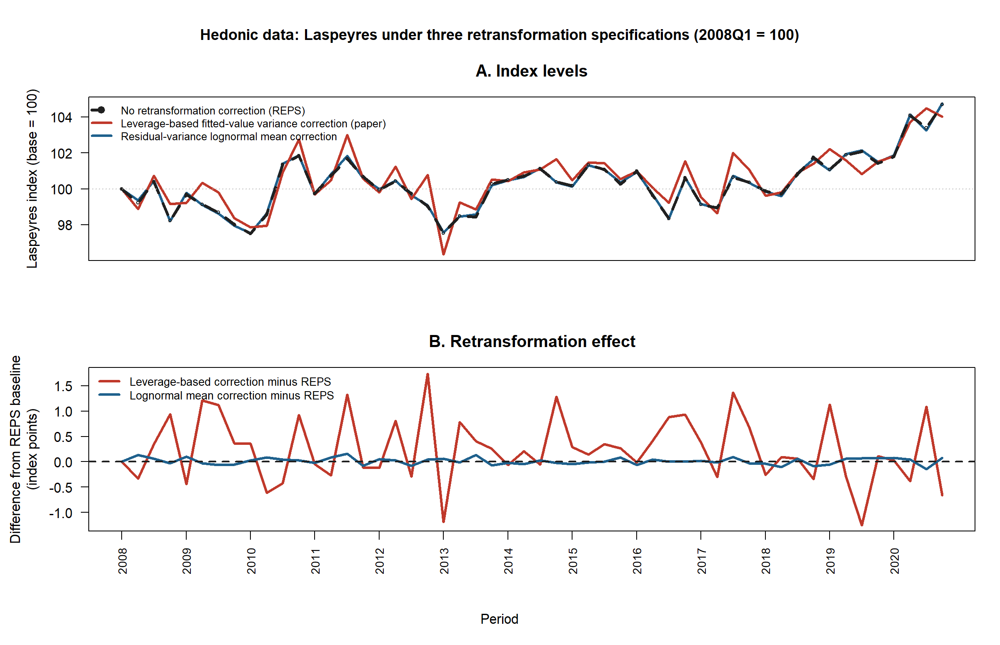
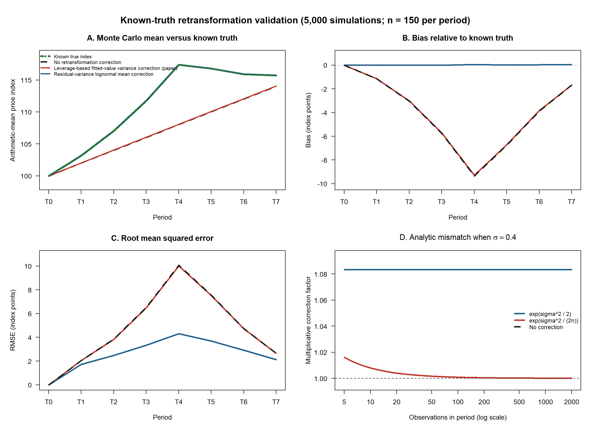
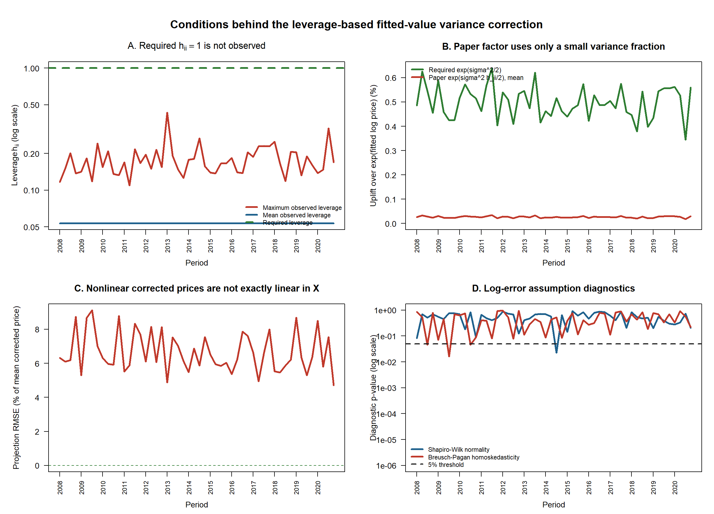

# Retransforming log prices in hedonic price indices

## Purpose and conclusion

This note evaluates the retransformation correction proposed in `data_transformatie.pdf`. The issue arises when a hedonic model is fitted to log prices but the result is interpreted on the original price scale.

The central conclusion is narrow but decisive:

> **If the target is the conditional arithmetic mean of price under a lognormal error model, the required variance is the observation-level residual variance, $\sigma^2$. The paper instead uses the sampling variance of the fitted log mean, $\sigma^2 h_{ii}$. These are different quantities.**

The paper's correction changes the empirical indices, sometimes visibly, but a larger change is not evidence of a better correction. A known-truth simulation shows that the residual-variance lognormal correction recovers the intended arithmetic-mean index, while the leverage-based correction remains close to the uncorrected index and retains almost all of its bias.

This conclusion is conditional on the estimand:

- If the target is a **geometric mean or conditional median**, exponentiating the fitted log price without a correction is appropriate.
- If the target is a **conditional arithmetic mean** and log errors are normal and homoskedastic, use the residual-variance factor $\exp(\sigma^2/2)$.
- The leverage-based factor $\exp(\sigma^2 h_{ii}/2)$ does not target the arithmetic mean of an observed price.

## 1 The source of the problem

Consider the semi-log hedonic model

$$
\log(P_i)=x_i'\beta+\varepsilon_i,
\qquad \varepsilon_i\sim N(0,\sigma^2).
$$

Exponentiating the fitted log price gives

$$
\exp(x_i'\hat\beta),
$$

which estimates a geometric-mean or median-type price level. It is not the conditional arithmetic mean because exponentiation is nonlinear. Under the stated normal error model,

$$
E(P_i\mid x_i)
=\exp(x_i'\beta)E[\exp(\varepsilon_i)]
=\exp\!\left(x_i'\beta+\frac{\sigma^2}{2}\right).
$$

The required retransformation factor is therefore

$$
\boxed{\exp(\sigma^2/2)}.
$$

### What the paper does instead

The paper calculates the variance of the fitted log mean,

$$
\operatorname{Var}(\hat y_i\mid X)
=\sigma^2x_i'(X'X)^{-1}x_i
=\sigma^2h_{ii},
$$

and constructs corrected fitted prices as

$$
\hat P_i^{\text{paper}}
=\exp(\hat y_i)\exp\!\left(\frac{\hat\sigma^2h_{ii}}{2}\right).
$$

It then projects these nonlinear corrected prices back onto the original design matrix:

$$
\hat\beta_{\text{back}}
=(X'X)^{-1}X'\hat P^{\text{paper}}.
$$

The first variance describes **uncertainty in the estimated regression mean**. The second describes **variation of an observed log price around that mean**. A retransformation from $\log(P_i)$ to $E(P_i\mid x_i)$ requires the second quantity.

For the paper factor to equal the raw-price lognormal factor observation by observation, one would need

$$
\sigma^2h_{ii}=\sigma^2,
$$

so either $h_{ii}=1$ or $\sigma^2=0$. In a full-rank OLS model, $\sum_i h_{ii}=k$. Requiring $h_{ii}=1$ for every row implies $k=n$, leaving no residual degrees of freedom with which to estimate $\sigma^2$. This is the structural contradiction at the heart of the method.

## 2 What happens on the hedonic dataset

We first compare the three approaches on the bundled fictitious hedonic dataset: 7,800 transactions, 52 quarters from 2008Q1 to 2020Q4, and 150 observations per quarter. The models use floor area, distance to a train station, neighbourhood, and a large-city indicator. Every series uses the same observations, model specification, factor levels, periods, and base period. Only the retransformation step changes.

**Figure 1. Empirical Laspeyres comparison.** The upper panel shows the complete indices; the lower panel shows each correction minus the REPS baseline.

What the figure shows:

- The black dashed series is the current REPS index without retransformation correction.
- The blue residual-variance lognormal series is close to the black series. This is expected because the estimated residual variances differ only modestly across quarters; much of the multiplicative correction cancels when every period is divided by the same base period.
- The red leverage-based series moves considerably more. Its movement is produced by observation-specific leverage factors and by the additional nonlinear-to-linear projection. That movement demonstrates sensitivity, not correctness.
- The lower panel is essential: it reveals differences that are hidden when the index-level series overlap.

The same calculation was repeated for every REPS hedonic method except HMTS.

| Index method | Maximum paper minus REPS difference | Maximum lognormal minus REPS difference | Interpretation |
|---|---:|---:|---|
| Laspeyres | 1.739 | 0.156 | Period residual variances differ slightly |
| Paasche | 1.576 | 0.155 | Same pattern as Laspeyres |
| Fisher | 1.657 | 0.156 | Geometric combination of Laspeyres and Paasche |
| Time Dummy | 1.653 | approximately 0 | The common lognormal factor cancels |
| Rolling Time Dummy | 2.102 | approximately 0 | The factor cancels within each rolling-window link |
| Repricing | 0.183 | approximately 0 | The factor cancels in the within-model prediction ratio |

The empirical exercise answers **what changes**, but it cannot answer **which estimate is closer to truth**, because the true index is unknown. That requires a controlled experiment.

## 3 Known-truth validation

The validation uses an intercept-only special case of the hedonic model:

$$
\log(P_{ti})=\mu_t+\varepsilon_{ti},
\qquad \varepsilon_{ti}\sim N(0,\sigma_t^2).
$$

This is deliberately simple: the true arithmetic-mean price is known exactly,

$$
E(P_{ti})=\exp(\mu_t+\sigma_t^2/2).
$$

With $n$ observations in a period, every leverage equals $1/n$. The three estimated levels therefore become

$$
\begin{aligned}
\text{No correction:}      && \exp(\bar y_t),\\
\text{Paper correction:}   && \exp\!\left(\bar y_t+\frac{s_t^2}{2n}\right),\\
\text{Lognormal correction:}&& \exp\!\left(\bar y_t+\frac{s_t^2}{2}\right).
\end{aligned}
$$

We generated 5,000 datasets with 150 observations in each of eight periods. Residual variances deliberately vary by period so that the difference between a geometric-mean and arithmetic-mean index is visible. The algebra does not depend on this particular variance profile.

**Figure 2. Known-truth validation.** Panel A compares the Monte Carlo mean of each estimator with the known true index. Panel B shows bias, panel C shows RMSE, and panel D isolates the analytical difference between the two correction factors.

What the figure shows:

- In panel A, the residual-variance lognormal estimate follows the green true-index line. The uncorrected and paper estimates overlap well below the truth when residual variance increases.
- Panel B shows that the paper correction removes almost none of the bias. The lognormal correction remains close to zero bias.
- Panel C shows that the lognormal method also has substantially lower RMSE. It still has sampling variation; a correct estimand does not eliminate estimation noise.
- Panel D gives the decisive asymptotic result. The required factor $\exp(\sigma^2/2)$ remains above one. The paper factor $\exp(\sigma^2/(2n))$ converges to one as the sample size grows. More data therefore make the paper correction disappear, even though the raw-price retransformation factor remains necessary.

| Method | Mean absolute period bias | Pooled RMSE | Maximum absolute period bias |
|---|---:|---:|---:|
| No retransformation correction | 4.507 | 5.971 | 9.337 |
| Leverage-based paper correction | 4.478 | 5.941 | 9.277 |
| Residual-variance lognormal correction | **0.025** | **3.056** | **0.062** |

The simulation does not argue that real housing errors must be normal and homoskedastic. It establishes that **even under the model most favourable to a closed-form lognormal correction**, the fitted-value variance is the wrong variance for the arithmetic-mean estimand.

## 4 Are the paper method's conditions present in the real data

The final diagnostic checks the period-specific hedonic regressions directly.

**Figure 3. Condition diagnostics on the hedonic dataset.** Panels A and B test the variance equality required for a raw-price mean. Panel C checks the second-stage projection. Panel D reports conventional residual diagnostics.

What the figure shows:

- **Panel A:** observed leverages range from 0.0259 to 0.4310; none equals the required value one. The mean leverage is approximately $k/n=8/150=0.0533$.
- **Panel B:** because the paper multiplies the residual variance by leverage, it uses only a small fraction of the required lognormal correction. The required price uplift is roughly 0.35% to 0.65%; the paper's average uplift is only about 0.02% to 0.03%.
- **Panel C:** corrected fitted prices are nonlinear in the regressors. Projecting them back onto $X$ is therefore an approximation, with a relative projection RMSE of roughly 5% to 9% across periods. The projection is exact in none of the 52 periods.
- **Panel D:** normality is rejected in 1 of 52 periods and homoskedasticity in 3 of 52 periods at the 5% level. These diagnostics mostly look acceptable. That is useful: the failure of the paper method is not being driven by obviously poor residual diagnostics. The structural variance mismatch remains even when those assumptions are not rejected.

The full-rank condition is met in all 52 models, residual variance is positive in all periods, and $h_{ii}=1$ is met by 0 of 7,800 observations. The equality needed to treat $\sigma^2h_{ii}$ as the raw-price retransformation variance therefore fails for every transaction.

## 5 Practical interpretation

The disagreement is not fundamentally about whether a correction should make a graph move. It is about defining the quantity being estimated.

| Intended quantity | Appropriate transformation under the stated model |
|---|---|
| Conditional median or geometric-mean price | $\exp(x'\hat\beta)$ |
| Conditional arithmetic-mean price with normal homoskedastic log errors | $\exp(x'\hat\beta+\hat\sigma^2/2)$ |
| Arithmetic mean with non-normal log errors | Estimate $E[\exp(\varepsilon)\mid X]$, for example with a justified smearing or conditional-variance method |
| Sampling uncertainty of the fitted log mean | $\hat\sigma^2h_{ii}$, used for inference about the fitted mean, not raw-price retransformation |

For Time Dummy, Rolling Time Dummy, and Repricing, a common residual-variance factor can cancel from the relevant ratio. In those cases a valid correction may leave the index unchanged. That is a property of the index formula, not evidence that the correction is useless.

## Bottom line

The paper correctly identifies $\sigma^2h_{ii}$ as the sampling variance of an OLS fitted log mean. The methodological error is using that variance as though it were the residual variance of an observed log price. The two quantities answer different questions.

On the real hedonic dataset, the leverage-based correction creates larger movements because leverage varies and corrected fitted prices are projected through a second raw-price regression. In a simulation where truth is known, those movements do not translate into meaningful bias reduction. The residual-variance lognormal correction targets the arithmetic mean and recovers the known index with negligible bias under the stated model.

## Reproducibility

The evidence in this note is generated by three standalone R scripts, all runnable interactively in VS Code with `source()`:

- [`compare_retransformation_methods_hedonic_data.R`](scripts/compare_retransformation_methods_hedonic_data.R) reproduces the empirical index comparisons.
- [`validate_retransformation_methods_simulation.R`](scripts/validate_retransformation_methods_simulation.R) runs the known-truth Monte Carlo validation.
- [`diagnose_leverage_correction_conditions_hedonic_data.R`](scripts/diagnose_leverage_correction_conditions_hedonic_data.R) evaluates the method's structural conditions and residual diagnostics.

Methodological source reviewed: `data_transformatie.pdf`.
