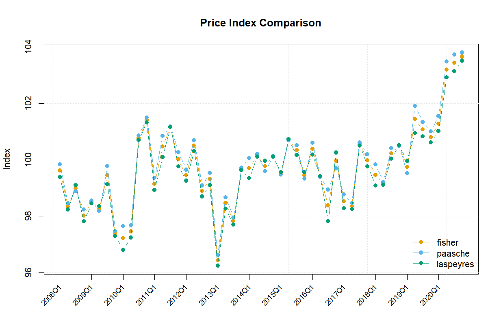

```{r, include = FALSE}
knitr::opts_chunk$set(
  collapse = TRUE,
  comment = "#>"
)
```

```{r setup, include=FALSE}
library(REPS)
data("data_constraxion")
```

## Introduction

The `calculate_price_index()` function is the central entry point in `REPS` for computing price indices using various **hedonic-based methods**. It supports six commonly used approaches:

- **Laspeyres** – hedonic double imputation base-weighted index  
- **Paasche** – hedonic double imputation current-weighted index  
- **Fisher** – geometric average of Laspeyres and Paasche (both hedonic double imputation)  
- **HMTS** – Hedonic Multilateral Time Series re-estimation Splicing  
- **Time Dummy** – single-regression hedonic index using time dummies  
- **Rolling Time Dummy** – chained index based on overlapping time-dummy regressions
- **Repricing** – quasi-repeat-sales method comparing observed vs predicted price changes

This vignette demonstrates how to apply each method using a consistent interface, making it easy to compare results across approaches.

The HMTS method implemented in `REPS` is a multilateral, time-series-based index that balances stability, limited revision, and early detection of turning points in the context of property price indices [@51c4602ed48c4adbb7b7d15176d2da7a].

For broader context and international guidelines on the compilation of property price indices, including traditional methods such as hedonic double imputation Laspeyres, Paasche, Fisher and Repricing, we refer to Eurostat's *Handbook on Residential Property Pricae Indices (RPPIs)* [@eurostat2013rppi]. For (Rolling) Time Dummy we refer to Hill et al. [@hill2018repricing; @hill2022rolling].


## Required Data

Before running any calculations, ensure that your dataset is available and contains the necessary variables:

```{r}
# Example dataset (you should already have this loaded)
head(data_constraxion)
```

The required variables include:

- `period_variable`: the time period  
- `dependent_variable`: usually price  
- `numerical_variables`: e.g., `floor_area`  
- `categorical_variables`: e.g., `neighbourhood_code`

Typically, for some numerical variables you may want to apply a log transformation. For example, `floor_area` is often log-transformed to improve linearity, stabilize variance, and reduce the impact of extreme values. Log-transforming variables can help meet regression assumptions by making relationships between variables more linear and residuals more homoscedastic (constant variance).

Example of log-transforming `floor_area`:

```{r}
dataset <- data_constraxion
dataset$floor_area <- log(dataset$floor_area)
```

## Using `calculate_price_index()`

The `calculate_price_index()` function provides a unified interface for estimating hedonic price indices. You only need to specify the method via the `method` argument — the function handles the rest.

Supported methods:

- `"laspeyres"`: base-period weighted double imputation  
- `"paasche"`: current-period weighted double imputation  
- `"fisher"`: geometric average of Laspeyres and Paasche  
- `"hmts"`: Hedonic Multilateral Time Series with re-estimation and splicing  
- `"timedummy"`: single time-dummy regression (log-linear hedonic model with time factors)  
- `"rolling_timedummy"`: chained index from overlapping time-dummy regressions  
- `"repricing"`: compares observed vs predicted price growth in consecutive periods (quasi-repeat-sales)


### Example: Single Index Method - Time Dummy

```{r}
Tbl_TD <- calculate_price_index(
  dataset = dataset,
  method = "timedummy",
  period_variable = "period",
  dependent_variable = "price",
  numerical_variables = c("floor_area", "dist_trainstation"),
  categorical_variables = c("dummy_large_city", "neighbourhood_code"),
  reference_period = 2015,
  number_of_observations = FALSE
)

head(Tbl_TD)
```

### Example: Multiple Index Methods - Fisher, Paasche and Laspeyres

```{r}
multi_result <- calculate_price_index(
  dataset = dataset,
  method = c("fisher", "paasche", "laspeyres"),
  period_variable = "period",
  dependent_variable = "price",
  numerical_variables = c("floor_area", "dist_trainstation"),
  categorical_variables = c("dummy_large_city", "neighbourhood_code"),
  reference_period = 2015,
  number_of_observations = FALSE
)

head(multi_result$fisher)
head(multi_result$paasche)
head(multi_result$laspeyres)
```

### Visualizing the Index

For quick and clear visualizations, the `plot_price_index()` utility function can be used to generate time-series plots of the calculated indices.

While we encourage users to create custom visualizations suited to their analytical needs, this built-in plotting function provides a convenient starting point for simple and consistent line plots.


```r
plot_price_index(multi_result)

```
```{r echo=FALSE, out.width="100%", fig.align="center"}

```

## Summary

The `calculate_price_index()` function streamlines access to multiple hedonic index methods via a consistent interface. This allows analysts to easily compare outputs and select the most appropriate method for their context.

## References
