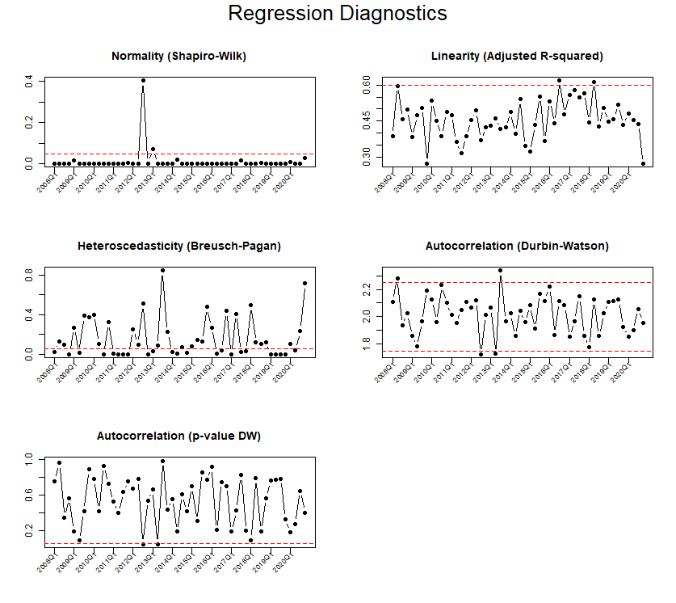

```{r, include = FALSE}
knitr::opts_chunk$set(
  collapse = TRUE,
  comment = "#>"
)
```

```{r setup, include=FALSE}
library(REPS)
data("data_constraxion")
```

## Introduction

The `calculate_regression_diagnostics()` function in **REPS** provides *regression diagnostics by period*. It is designed for panel or repeated cross-section data (e.g. property transactions over time) to evaluate the quality of **period-specific log-linear regressions**.

For each period, it:

- Fits a log-linear regression model: `log(price) ~ covariates`
- Computes diagnostics:
  - **Shapiro-Wilk p-value** (normality)
  - **Adjusted R-squared** (linearity)
  - **Durbin-Watson test** (autocorrelation)
  - **Breusch-Pagan test** (heteroscedasticity)

These diagnostics help assess **model quality over time**, identifying periods with issues like non-normality, low fit, heteroscedasticity, or autocorrelation.


## Required Data

Your dataset should include:

- A **period variable** (e.g. quarterly/annual codes)
- A **dependent variable** (typically price)
- One or more **numerical independent variables** (e.g. floor area)
- Optionally, **categorical independent variables** (e.g. neighbourhood codes)


```{r}
# Example dataset (you should already have this loaded)
head(data_constraxion)

# We log transform the floor_area again (see vignette on calculating price index as why)
dataset <- data_constraxion
dataset$floor_area <- log(dataset$floor_area)
```


## Using `calculate_regression_diagnostics()`

Example:

```{r}
diagnostics <- calculate_regression_diagnostics(
  dataset = dataset,
  period_variable = "period",
  dependent_variable = "price",
  numerical_variables = c("floor_area", "dist_trainstation"),
  categorical_variables = c("dummy_large_city", "neighbourhood_code")
)

head(diagnostics)
```

## Visualizing Diagnostics

For convenient visualization:

```r
plot_regression_diagnostics(diagnostics)
```

This generates a **3x2 grid** of plots:

- Normality (Shapiro-Wilk)
- Linearity (Adjusted R-squared)
- Autocorrelation (Durbin-Watson statistic)
- Autocorrelation (p-value Durbin-Watson)
- Heteroscedasticity (Breusch-Pagan)

Example:

```{r echo=FALSE, out.width="100%", fig.align="center"}

```

## Interpreting the Output

The hedonic approach of the price indices relies on a linear regression model. Exploitation of this linear model in the calculation of the price index depends on valid model assumptions. The generated figure with multiple plots helps assess the linear regression model assumptions:

On the left of the first row of the multiple plots is the plot of the p-values of the Shapiro-Wilk test of normality. Values of the solid line below the 0.05 significance level (dashed red line) may be an indication of violation of the normality condition of the linear regression model.

On the right of the first row of the multiple plots is the plot of the adjusted R-squared (coefficient of determination) for assessing the linearity assumptions. As a rule of thumb, values below 0.6 (the red dashed line) can be an indication of the absence of linearity.

On the left of the second row of the multiple plots is the plot of the Durbin-Watson statistic for the mutual independence condition of the residuals in the linear regression model. Values range from 0 to 4, with perfect independence at the value 2. As a rule of thumb, values out of the range 1.75–2.25 (the red dashed lines) along with the p-values (next plot) can be an indication of autocorrelated residuals in the linear regression model.

On the right of the second row of the multiple plots is the plot of the p-values of the Durbin-Watson test. Values exceeding the 0.05 significance level (dashed red line) suggest that there is no significant evidence to reject the null hypothesis of the mutual independence of the residuals in the linear regression model.

On the third row of the multiple plots, the plot of the p-values of the Breusch-Pagan statistic for the homoscedasticity (constant variance of the residuals) condition of the linear regression model is shown. Values of the solid line below the 0.05 significance level (dashed red line) can be an indication of the presence of heteroscedasticity (no constant variance) in the linear regression model.


## Summary

The `calculate_regression_diagnostics()` and `plot_regression_diagnostics()` functions in **REPS** enable:

- **Period-by-period regression checking**
- **Easy comparison of assumptions over time**
- **Detection of problematic periods**

They support **robust, high-quality** hedonic price index modeling by systematically checking regression assumptions.


## References

For further details on regression diagnostics and property price index methodology:

- Eurostat *Handbook on Residential Property Price Indices (RPPIs)* [@eurostat2013rppi]
