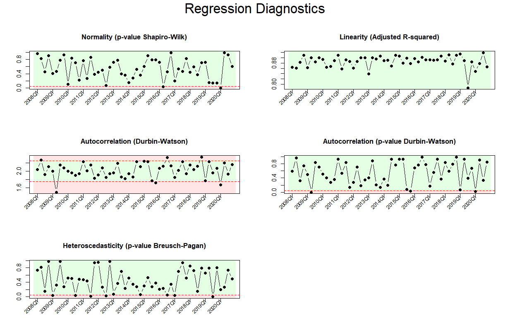

```{r, include = FALSE}
knitr::opts_chunk$set(
  collapse = TRUE,
  comment = "#>"
)
```

```{r setup, include=FALSE}
library(REPS)
data("data_constraxion")
```

## Introduction

The `calculate_regression_diagnostics()` function in **REPS** provides *regression diagnostics by period*. It is designed for panel or repeated cross-section data (e.g. property transactions over time) to evaluate the quality of **period-specific log-linear regressions**.

For each period, it:

- Fits a log-linear regression model: `log(price) ~ covariates`
- Computes diagnostics:
  - **Shapiro-Wilk p-value** (normality)
  - **Adjusted R-squared** (linearity)
  - **Durbin-Watson test** (autocorrelation)
  - **Breusch-Pagan test** (heteroscedasticity)

These diagnostics help assess **model quality over time**, identifying periods with issues like non-normality, low fit, heteroscedasticity, or autocorrelation.


## Required Data

Your dataset should include:

- A **period variable** (e.g. quarterly/annual codes)
- A **dependent variable** (typically price)
- One or more **numerical independent variables** (e.g. floor area)
- Optionally, **categorical independent variables** (e.g. neighbourhood codes)


```{r}
# Example dataset (you should already have this loaded)
head(data_constraxion)

# We log transform the floor_area again (see vignette on calculating price index as why)
dataset <- data_constraxion
dataset$floor_area <- log(dataset$floor_area)
```


## Using `calculate_regression_diagnostics()`

Example:

```{r}
diagnostics <- calculate_regression_diagnostics(
  dataset = dataset,
  period_variable = "period",
  dependent_variable = "price",
  numerical_variables = c("floor_area", "dist_trainstation"),
  categorical_variables = c("dummy_large_city", "neighbourhood_code")
)

head(diagnostics)
```

## Visualizing Diagnostics

For convenient visualization:

```r
plot_regression_diagnostics(diagnostics)
```

This generates a **3x2 grid** of plots:

- Normality (p-value Shapiro-Wilk)
- Linearity (Adjusted R-squared)
- Autocorrelation (Durbin-Watson statistic)
- Autocorrelation (p-value Durbin-Watson)
- Heteroscedasticity (p-value Breusch-Pagan)

Example:

```{r echo=FALSE, out.width="100%", fig.align="center"}

```

## Interpreting the Output

The hedonic price index relies on a log-linear regression model, which assumes that certain statistical conditions hold. The diagnostics plot provides an overview of how well these assumptions are met across different periods.

Each subplot corresponds to a specific model assumption:

### Row 1: Normality and Linearity

- **Shapiro-Wilk test (left plot)**  
  - Shows p-values for the normality of residuals.  
  - A p-value below 0.05 (dashed red line) indicates a potential violation of the normality assumption.

- **Adjusted R-squared (right plot)**  
  - Reflects the explanatory power of the regression model.  
  - Values below 0.6 (dashed red line) may indicate a weak linear relationship.

### Row 2: Independence

- **Durbin-Watson statistic (left plot)**  
  - Tests for autocorrelation in residuals.  
  - Ideal value is around 2.  
  - Values outside the 1.75–2.25 range (dashed lines) suggest potential autocorrelation.

- **Durbin-Watson p-value (right plot)**  
  - Indicates whether autocorrelation is statistically significant.  
  - p > 0.05: no significant evidence of autocorrelation.  
  - p ≤ 0.05: residuals may not be independent.

### Row 3: Homoscedasticity

- **Breusch-Pagan p-value**  
  - Tests whether residuals have constant variance.  
  - A p-value below 0.05 (dashed red line) suggests heteroscedasticity (non-constant variance).

## Summary

The `calculate_regression_diagnostics()` and `plot_regression_diagnostics()` functions in **REPS** enable:

- **Period-by-period regression checking**
- **Easy comparison of assumptions over time**
- **Detection of problematic periods**

They support **robust, high-quality** hedonic price index modeling by systematically checking regression assumptions.


